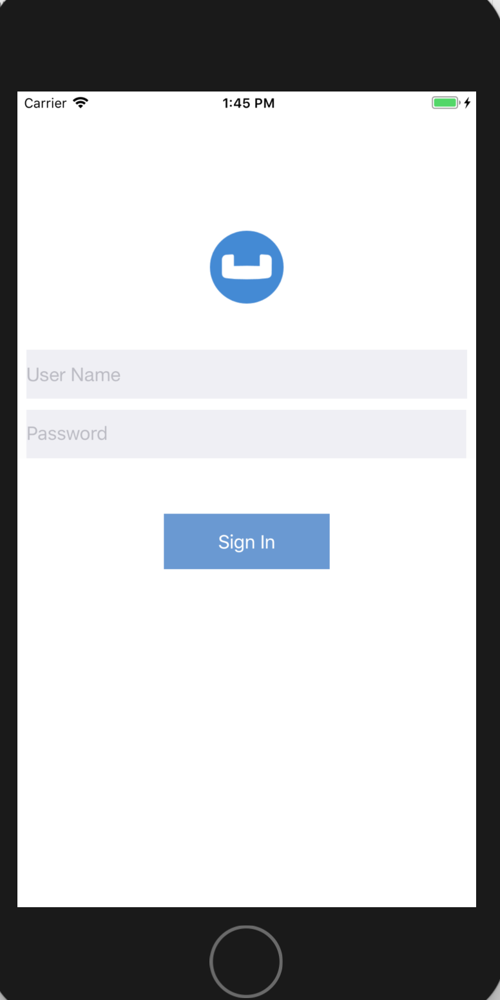

:toc: left
:toclevels: 3
:codedir: https://github.com/couchbaselabs/userprofile-couchbase-mobile/blob/standalone/code/UserProfileDemo
toc::[]
:icons: font
:quick-uri: https://asciidoctor.org/docs/asciidoc-syntax-quick-reference/

== Introduction
Couchbase Mobile brings the power of NoSQL to the edge. It is comprised of three components:

* _Couchbase Lite_, an embedded NoSQL database for your mobile apps
* _Sync Gateway_, an internet-facing synchronization mechanism that securely syncs data between mobile clients and server, and
* _Couchbase Server_, a highly scalable, distributed NoSQL database platform

Couchbase Mobile supports flexible deployment models. You can  

* Use Couchbase Lite as a standalone embedded database with your mobile apps or,
* Use Couchbase Lite enabled mobile clients with a Sync Gateway to sychronize data between your mobile clients or,
* Use Couchbase Lite enabled clients with a Sync Gateway to sync data between mobicle clients and the Couchbase Server, which can persist data in the cloud (public or private) 

This tutorial will walk you through a sample iOS app that will demonstrate how you can get started with Couchbase Lite 2.0 in *standalone mode* as a local embedded store.


====
You can learn more about Couchbase Mobile https://developer.couchbase.com/mobile[here]
====

== Prerequisites
* iOS (Xcode 9.3+) 
  Download latest version from the link:https://itunes.apple.com/us/app/xcode/id497799835?mt=12[Mac App Store]
            
                
* git

** Create a link:https://github.com[free github account] if you don't already have one
** git can be downloaded from link:https://git-scm.com/book/en/v2/Getting-Started-Installing-Git[git-scm.org]
              

== Installation
- Clone the _standalone_ branch of the `User Profile Demo` app from GitHub.
  
[source,bash] 
----
  git clone -b standalone https://github.com/couchbaselabs/userprofile-couchbase-mobile.git
----

- Next, we will download the Couchbase Lite 2.0 framework. The Couchbase Lite iOS framework is link:TODO[distributed] via Cocoapods, Carthage or you can download the pre-built framework. In our example, we will be downloading the pre-built version of the framework. For this, do the following 
[source,bash] 
----
  cd /path/to/UserProfileDemo/code/

  sh install_9.sh
----
Now, let's verify the installation

=== Try it Out
* Open the `UserProfileDemo.xcodeproj`. The project would be located at `/path/to/UserProfileDemo/code/`
[source,bash]
----
open UserProfileDemo.xcodeproj
----
* Build and run the project using simulator in Xcode
* Verify that you see the login screen
      


== Data Model
Couchbase Lite is a JSON Document Store. A Document is a logical collection of named fields and values.The values are any valid JSON types. In addition to the standard JSON types, Couchbase Lite supports `Date` and `Blob` data types. 
While it is not required or enforced, it is a recommended practice to include a _"type"_ property that can serve as a namespace for related. 

=== "user" Type Document
The app deals with a single Document with a _"type"_ property of _"user"_.   The document ID is of the form _"user::<email>"_.
An example of a document would be 

```json
{
    "type":"user",
    "name":"Jane Doe",
    "email":"jame.doe@earth.org",
    "address":"101 Main Street",
    "image":TBD
}
```
=== UserRecord 
The _"user"_ Document is encoded to a native struct 

TBD : Get right path
[source,swift]
----
include::{codedir}/model/UserRecord.swift[tags=userrecord]
----

== Basic Database Operations
In this section, we will do a code walkthrough of the basic Database operations

=== Open/ Create a Database
When a user logs in, we create a Couchbase Lite Database for the user if one does not exist.

* Open the *DatabaseManager.swift* file and locate the `openOrCreateDatabaseForUser()` function. 
[source,swift]
----
include::{codedir}/model/DatabaseManager.swift[tags=openOrCreateDatabaseForUser]
----

* We create an instance of the `DatabaseConfiguration`. This is an optional step. In our case, we would like to override the default path of the Database. Every user has their own instance of the Database that is located in a folder corresponding to the user.
[source,swift]
----
include::{codedir}/model/DatabaseManager.swift[tags=dbconfig]
----

* Then we create a local Couchbase Lite database for the user. If a database already exists for the user, the existing version is returned. We track the `ListenerToken` as it is needed for removing the listener.
[source,swift]
----
include::{codedir}/model/DatabaseManager.swift[tags=dbcreate]
----

=== Listening to Database Changes
You can be asynchornously notified of any change (add, delete, update) to the Database by registering a change listener with the Database. In our app, we are not doing anything special with the Database change notification other than logging the change. In a real world app, you would use this notification for instance, to update the UI.

* Open the *DatabaseManager.swift* file and locate the `registerForDatabaseChanges()` function. 
[source,swift]
----
include::{codedir}/model/DatabaseManager.swift[tags=registerForDatabaseChanges]
----

* We register a change listener with the database. This is an optional step. In our case, we would like to override the default path of the Database. Every user has their own instance of the Database that is located in a folder corresponding to the user.
[source,swift]
----
include::{codedir}/model/DatabaseManager.swift[tags=adddbchangelistener]
----

== Close a Database
When a user logs out, we close the Couchbase Lite Database associated with the user and deregister any database change listener

* Open the *DatabaseManager.swift* file and locate the `closeDatabaseForCurrentUser()` function. 
[source,swift]
----
include::{codedir}/model/DatabaseManager.swift[tags=closeDatabaseForCurrentUser]
----

* Closing the database is pretty straightforward
[source,swift]
----
include::{codedir}/model/DatabaseManager.swift[tags=dbclose]
----

=== Deregistering for  Database Changes

* Open the *DatabaseManager.swift* file and locate the `deregisterForDatabaseChanges()` function. 
[source,swift]
----
include::{codedir}/model/DatabaseManager.swift[tags=deregisterForDatabaseChanges]
----

* We stop listening to database changes by passing in the `ListenerToken` associated with the listener. 
[source,swift]
----
include::{codedir}/model/DatabaseManager.swift[tags=removedbchangelistener]
----


== Document CRUD Operations

.Image caption
image::image-file-name.png[I am the image alt text.]

This is another paragraph.footnote:[I am footnote text and will be displayed at the bottom of the article.]

=== Second level heading

.Unordered list title
* list item 1
** nested list item
*** nested nested list item 1
*** nested nested list item 2
* list item 2

This is a paragraph.

.Example block title
====
Content in an example block is subject to normal substitutions.
====

.Sidebar title
****
Sidebars contain aside text and are subject to normal substitutions.
****

==== Third level heading

[[id-for-listing-block]]
.Listing block title
----
Content in a listing block is subject to verbatim substitutions.
Listing block content is commonly used to preserve code input.
----

===== Fourth level heading

.Table title
|===
|Column heading 1 |Column heading 2

|Column 1, row 1
|Column 2, row 1

|Column 1, row 2
|Column 2, row 2
|===

====== Fifth level heading

[quote, firstname lastname, movie title]
____
I am a block quote or a prose excerpt.
I am subject to normal substitutions.
____

[verse, firstname lastname, poem title and more]
____
I am a verse block.
  Indents and endlines are preserved in verse blocks.
____

== First level heading

TIP: There are five admonition labels: Tip, Note, Important, Caution and Warning.

// I am a comment and won't be rendered.

. ordered list item
.. nested ordered list item
. ordered list item

The text at the end of this sentence is cross referenced to <<_third_level_heading,the third level heading>>

== First level heading

This is a link to the https://asciidoctor.org/docs/user-manual/[Asciidoctor User Manual].
This is an attribute reference {quick-uri}[which links this text to the Asciidoctor Quick Reference Guide].
